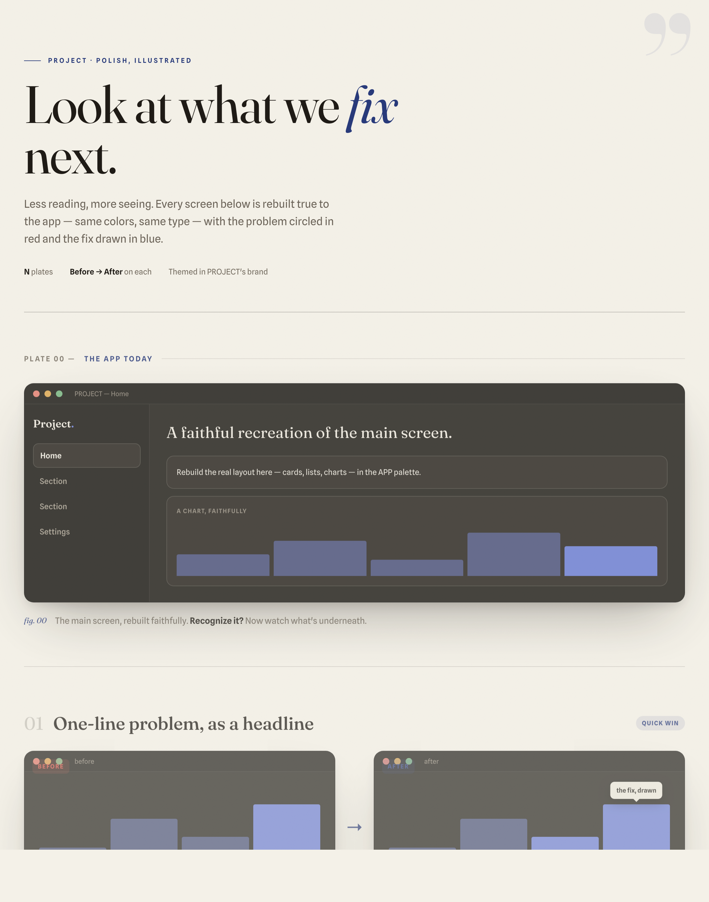

# picture-book-audit

**A Claude Code skill that reviews any project as an illustrated before/after picture book — not a wall of text.**

Point it at a codebase and it produces a single self-contained HTML report: what the product looks like *today*, what to *polish*, and what to *build next* — every point drawn as a faithful mockup of the real UI, with the problem circled in red and the fix sketched in blue. It themes itself in the audited project's own brand, so each report looks native to its app.



---

## Why

Most "here's how to improve your app" output is a bullet list nobody reads. This skill inverts that: **show, don't tell.** Reading is minimal — one figure caption per plate — and the pictures carry the argument. The result is something you can actually hand to a teammate or stakeholder and have them *get it* in a scroll.

## What's fixed vs. what adapts

- **Fixed — the format** (the signature): a cover, a faithful "app today" plate, 6–10 before→after finding plates, an impact×effort matrix, and a quick-win shortlist.
- **Fixed — the discipline**: every plate is grounded in a real file (it reads your code, it doesn't invent problems), and the report is headless-rendered and inspected before it's delivered.
- **Adapts — the skin**: colors are derived from *your* project's real brand (CSS variables / Tailwind theme / design tokens), so no two audits look the same. Fonts default to a distinctive editorial pairing (Fraunces + Spline Sans) and can flex to your project's own type.

It's mostly UI/UX, but it can also cover **performance, backend, and accessibility** as diagrams — e.g. "cold start 2.1s → 0.8s" as a bar, a request waterfall, a focus-ring fix.

## The plates

| Section | What it shows |
|---|---|
| **Cover** | Title + one-line standfirst |
| **Plate 00 — the app today** | One faithful full mockup of the current main screen |
| **Findings (×6–10)** | Each a `Before → After` pair: problem circled in red, fix drawn in blue, one grounded caption |
| **Add next** | Net-new features shown as *after-only* mockups |
| **Impact × effort matrix** | Every finding plotted; the "ship this week" corner marked |
| **Quick-win shortlist** | 3–5 items with rough effort estimates |

## Install

Drop the folder into your Claude Code skills directory:

```bash
git clone https://github.com/ajjucoder/picture-book-audit.git \
  ~/.claude/skills/picture-book-audit
```

Claude Code discovers it automatically.

## Use

In any project, just ask in your own words:

- *"Show me what we should improve."*
- *"Picture-book audit this."*
- *"How can we make this look better — and what should we build next?"*
- *"Scan the UI/UX."*

The skill reads your project, derives its palette, builds the plates, headless-renders and checks the result, then opens `design/<project>-picture-book.html`.

## How it works

1. **Derive two palettes** from the project's real brand — one for the report wrapper, one for the app mockups.
2. **Scan and ground** — read the key UI files (and any perf/backend hot spots); every finding cites a real file.
3. **Build faithful plates** from `template.html`'s component kit so the mockups read like screenshots of *your* app.
4. **Render-verify** — headless-screenshot, inspect, fix overflow/clipping, repeat, then open.

## Files

- **`SKILL.md`** — the process and quality bar (this is what Claude reads).
- **`template.html`** — the locked layout + the full reusable component kit (device frames, before/after plates, annotation pins/rings, matrix, shortlist, diagram blocks) with CSS-variable palettes to fill.

## License

MIT — see [LICENSE](LICENSE).
